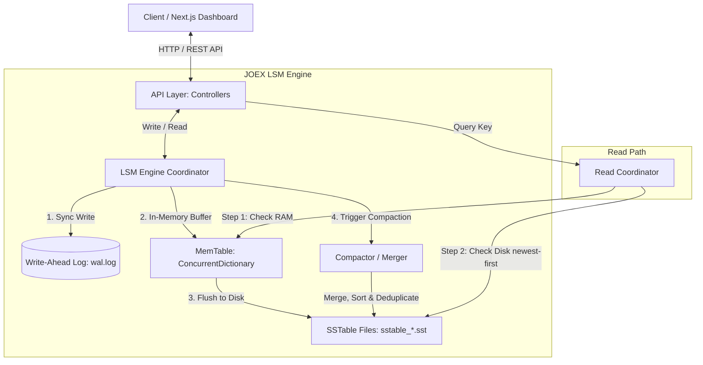
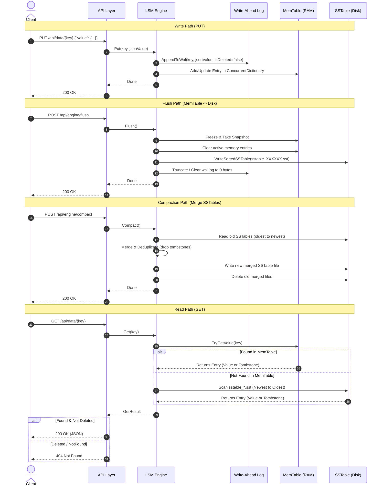

# 🚀 JOEX DB Engine

[](https://dotnet.microsoft.com/)
[](https://nextjs.org/)
[](https://react.dev/)
[](https://tailwindcss.com/)
[](LICENSE)

An educational, high-performance, lightweight database engine built from scratch in **C#** utilizing **.NET 9.0**. Inspired by modern Log-Structured Merge-Tree (LSM-Tree) databases like RocksDB, LevelDB, and Cassandra, **JOEX DB Engine** models storage engine internals (MemTable, WAL, SSTables, and Compaction) alongside a modern, reactive Next.js admin dashboard to visualize the system components in real time.

---

## 📋 Table of Contents

1. [✨ Features](#-features)
2. [🏗️ Architecture Overview](#️-architecture-overview)
3. [⚙️ System Design & Core Components](#️-system-design--core-components)
4. [🔄 Complete Data Flow](#-complete-data-flow)
5. [📂 Project Structure](#-project-structure)
6. [🛠️ Technologies Used](#️-technologies-used)
7. [🚀 Installation & Setup](#-installation--setup)
   - [Prerequisites](#prerequisites)
   - [Building and Running the Backend](#building-and-running-the-backend)
   - [Running the Frontend Dashboard](#running-the-frontend-dashboard)
8. [🔌 API Documentation](#-api-documentation)
   - [Data Endpoints](#data-endpoints)
   - [Engine Administration Endpoints](#engine-administration-endpoints)
9. [💻 Example cURL Usage](#-example-curl-usage)
10. [⚙️ Configuration (appsettings.json)](#️-configuration-appsettingsjson)
11. [📝 Logging System](#-logging-system)
12. [📸 Dashboard Screenshots](#-dashboard-screenshots)
13. [⚡ Performance Considerations](#-performance-considerations)
14. [🔮 Future Improvements](#-future-improvements)
15. [🤝 Contributing Guidelines](#-contributing-guidelines)
16. [📄 License](#-license)
17. [👥 Authors & Contact](#-authors--contact)
18. [💖 Acknowledgements](#-acknowledgements)

---

## ✨ Features

- **🚀 LSM-Tree Storage Architecture**: Implements a write-optimized Log-Structured Merge-Tree storage format.
- **💾 In-Memory MemTable**: Uses thread-safe data structures (`ConcurrentDictionary`) to buffer writes in RAM, ensuring low latency.
- **🪵 Binary Write-Ahead Log (WAL)**: Records all modifications to disk before updating memory, ensuring data persistence and crash recovery.
- **📦 Immutable SSTables**: Flushes in-memory data to immutable sorted disk files (`sstable_XXXXXX.sst`) using efficient binary serialization.
- **🧹 Single-Pass Compaction**: Merges and deduplicates multiple SSTables, purges tombstones (deleted records), and optimizes read paths.
- **🔌 Developer-Friendly REST APIs**: Exposes data manipulation (`PUT`, `GET`, `DELETE`) and engine control (`Flush`, `Compact`, `Start`, `Stop`) APIs.
- **📊 Real-time Next.js Dashboard**: Visualizes WAL size, MemTable usage, active SSTables, and compaction operations with a premium UI.
- **🛠️ Self-Contained & Lightweight**: No heavy dependencies; built purely with native .NET libraries.

---

## 🏗️ Architecture Overview

The system divides responsibilities between the **ASP.NET Core REST API** layer, the core **LSM Storage Engine**, and the **Next.js client Dashboard**:



---

## ⚙️ System Design & Core Components

### 1. Engine (`LsmEngine`)
The main coordinator of the system. It handles incoming reads, writes, and deletes, orchestrates the lifecycle of the WAL and MemTable, and exposes controls to manually flush the MemTable to disk or execute compactions.

### 2. MemTable
An active, in-memory write buffer. All data writes (`Put`) and deletions (`Delete`) are cached in a thread-safe `ConcurrentDictionary` map. The MemTable provides instantaneous $O(1)$ read and write performance.

### 3. Write-Ahead Log (WAL)
An append-only log file (`wal.log`) written in a fast binary format. Before a write is committed to the MemTable, it is serialized directly to the WAL:
- Structure per log record: `[Key (string)] + [IsDeleted (bool)] + [Value (string)]`.
- On engine boot, if a `wal.log` is detected, the engine deserializes and replays the records into the MemTable, guaranteeing zero data loss on unexpected shutdowns.

### 4. SSTables (Sorted String Tables)
When the MemTable is flushed, its entries are sorted lexicographically by key and serialized into a binary SSTable file (`sstable_XXXXXX.sst`). Because SSTables are sorted:
- They allow fast binary search lookups (conceptually).
- They can be merged efficiently via a simple merge-sort algorithm.
- They are completely **immutable** to avoid lock contention on disk reads.

### 5. LSM Tree Lifecycle
Writes accumulate in memory (MemTable) and write ahead to the WAL. Over time, the MemTable is frozen, flushed to SSTable files on disk (Layer 0), and the WAL is cleared. When files build up, a background or manually triggered compaction step merges files to optimize read queries.

### 6. Compaction
As files accumulate, reads can become slow due to search amplification (scanning multiple SSTables). The compactor merges all active SSTables:
1. Scans SSTables from oldest to newest.
2. Performs a key-by-key merge-sort.
3. Overwrites older values with newer updates.
4. Purges tombstoned (deleted) records entirely from disk since no older versions remain.
5. Deletes the old SSTable files and registers a single consolidated SSTable.

### 7. Indexing & Sparse Index
A helper structure (`SparseIndex`) is included which records specific key offsets at regular intervals within the storage blocks. Rather than scanning files entirely, reads query the sparse index to locate the closest byte offset in the SSTable file, jumping directly to the data.

### 8. Storage Manager
Determines file paths, verifies integrity of directories, manages active file lists (`_sstableFiles`), and handles cleanups of outdated logs or dead SSTables post-compaction.

### 9. API Layer
Built on ASP.NET Core Controllers. It translates JSON requests to typed models and interacts with the singleton storage engine instance.

---

## 🔄 Complete Data Flow



---

## 📂 Project Structure

```text
JOEX_DB_Engine/
├── JOEX_DB_Engine.sln              # Visual Studio Solution File
└── JOEX_DB_Engine/                 # Main Application Directory
    ├── Program.cs                  # Web Application Bootstrapper & DI Configuration
    ├── JOEX_DB_Engine.csproj       # .NET 9.0 Web API Project Configuration
    ├── appsettings.json            # Configuration file (database paths, port settings)
    ├── Controllers/
    │   ├── DataController .cs      # Operations on database records (GET/PUT/DELETE)
    │   └── EngineController.cs     # Operations on the LSM Engine (Flush/Compact/Stats)
    ├── Core/
    │   ├── Database.cs             # Legacy Database Wrapper
    │   └── MemTable.cs             # Legacy MemTable implementation
    ├── interfaces/
    │   ├── IDatabase.cs            # Interface for database actions
    │   ├── IMemTable.cs            # Interface for legacy MemTable
    │   └── IWAL.cs                 # Interface for legacy WAL
    ├── Models/
    │   ├── EngineStatistics.cs     # Internal telemetry metrics (Flushes, Compactions)
    │   ├── EngineStatusDto.cs      # Engine status DTO for dashboard API
    │   ├── IndexEntry.cs           # Index mapping model for sparse key searches
    │   ├── PutRequest.cs           # HTTP request model for data insertion
    │   └── Record.cs               # Representation of a single database record
    ├── Storage/
    │   ├── DataFile.cs             # Read/Write helper for legacy JSON database
    │   ├── SparseIndex.cs          # Conceptual sparse index implementation
    │   ├── WAL/
    │   │   └── WriteAheadLog.cs    # Text-based legacy Write-Ahead Log
    │   └── LsmData/
    │       ├── LsmEngine.cs        # CORE LSM Engine logic
    │       ├── wal.log             # Active binary WAL file (replayed on startup)
    │       └── sstable_*.sst       # Immutable SSTable files
    └── Frontend/
        └── client/                 # Next.js 16 Dashboard Project
            ├── package.json        # Node dependency manifest
            ├── tsconfig.json       # TypeScript configurations
            ├── next.config.ts      # Next.js configurations
            ├── app/                # App Router Layout & Page components
            │   ├── page.tsx        # Landing Page redirector
            │   ├── globals.css     # Global styles & Tailwind configs
            │   ├── dashboard/      # Admin dashboard landing layout
            │   ├── data/           # Key-Value browser panel
            │   ├── memtable/       # Real-time MemTable display
            │   ├── sstables/       # SSTable inspection interface
            │   └── wal/            # Write-Ahead Log console
            ├── components/         # Reusable React components (Charts, Cards, UI)
            └── public/             # Static Assets
```

---

## 🛠️ Technologies Used

### Backend (.NET Engine)
- **Framework**: [.NET 9.0](https://dotnet.microsoft.com/download/dotnet/9.0) / ASP.NET Core Web API
- **Concurrency**: Native thread-safe collections (`ConcurrentDictionary`, `lock` primitives)
- **Serialization**: Native `System.Text.Json` & `BinaryReader` / `BinaryWriter`
- **Documentation**: OpenAPI / Swagger (via Swashbuckle)

### Frontend (Dashboard Client)
- **Framework**: Next.js 16 (App Router) & React 19
- **Languages**: TypeScript & HTML5
- **Styling**: Tailwind CSS v4 & custom animations
- **Libraries**:
  - [Lucide React](https://lucide.dev/) (Vibrant iconography)
  - [Recharts](https://recharts.org/) (Interactive layout metrics charts)
  - [TanStack React Query](https://tanstack.com/query) (Asynchronous state caching and mutations)
  - [Axios](https://axios-http.com/) (HTTP Request client)

---

## 🚀 Installation & Setup

### Prerequisites
- [.NET 9.0 SDK](https://dotnet.microsoft.com/download/dotnet/9.0) (Ensure `dotnet` is in your environment PATH)
- [Node.js](https://nodejs.org/) (v18.x or higher) & npm

---

### Building and Running the Backend

1. **Navigate to the API project folder**:
   ```bash
   cd JOEX_DB_Engine/JOEX_DB_Engine
   ```

2. **Restore NuGet dependencies**:
   ```bash
   dotnet restore
   ```

3. **Build the project**:
   ```bash
   dotnet build
   ```

4. **Run the backend API server**:
   ```bash
   dotnet run
   ```
   *By default, the server launches with Swagger enabled. Look for the console logs indicating the local port, typically: [http://localhost:5242](http://localhost:5242) or similar. You can view the OpenAPI specification at `http://localhost:<PORT>/swagger/index.html`.*

---

### Running the Frontend Dashboard

1. **Navigate to the frontend client folder**:
   ```bash
   cd JOEX_DB_Engine/Frontend/client
   ```

2. **Install Node dependencies**:
   ```bash
   npm install
   ```

3. **Run the Next.js development server**:
   ```bash
   npm run dev
   ```
   *Open [http://localhost:3000](http://localhost:3000) in your web browser to interact with the visual dashboard.*

---

## 🔌 API Documentation

### Data Endpoints

| Endpoint | Method | Description | Request Body | Response Codes |
|---|---|---|---|---|
| `/api/data/{key}` | `GET` | Fetches a record by its unique key. Checks MemTable first, then searches SSTables. | None | `200 OK` (Found)<br>`404 Not Found` (Missing or Deleted) |
| `/api/data/{key}` | `PUT` | Inserts a new record. Fails with conflict if key already exists. | `{ "value": <any JSON> }` | `200 OK` (Written)<br>`400 Bad Request`<br>`409 Conflict` (Exists) |
| `/api/data/{key}` | `DELETE` | Deletes a record by writing a Tombstone record. | None | `200 OK` (Deleted) |

#### PUT Request Example
```json
{
  "value": {
    "username": "joex_dev",
    "role": "administrator",
    "status": "active"
  }
}
```

#### GET Response Example (Found)
```json
{
  "found": true,
  "key": "joex_dev",
  "value": "{\"username\":\"joex_dev\",\"role\":\"administrator\",\"status\":\"active\"}"
}
```

---

### Engine Administration Endpoints

| Endpoint | Method | Description | Request Body | Response Codes |
|---|---|---|---|---|
| `/api/engine/start` | `POST` | Starts/resumes the LSM Engine database. | None | `200 OK` |
| `/api/engine/stop` | `POST` | Pauses/stops the LSM Engine database. | None | `200 OK` |
| `/api/engine/status` | `GET` | Returns real-time health statistics of the engine. | None | `200 OK` |
| `/api/engine/memtable` | `GET` | Returns MemTable status, record count, and capacity. | None | `200 OK` |
| `/api/engine/wal` | `GET` | Returns size and state information for the Write-Ahead Log. | None | `200 OK` |
| `/api/engine/sstables` | `GET` | Returns a list of all SSTable files stored on disk. | None | `200 OK`<br>`404 Not Found`<br>`500 Server Error` |
| `/api/engine/flush` | `POST` | Forces the in-memory MemTable to persist to a new SSTable. | None | `200 OK` |
| `/api/engine/compact` | `POST` | Triggers a full merge-compaction on all SSTable files. | None | `200 OK`<br>`500 Server Error` |

#### Status Response Example
```json
{
  "status": "Running",
  "startedAt": "2026-07-25T01:33:21Z",
  "uptime": "00:15:30.1234567",
  "memTableRecords": 12,
  "sstableCount": 3,
  "walSize": 1024,
  "databaseSize": 1540,
  "flushCount": 3,
  "compactionCount": 1
}
```

---

## 💻 Example cURL Usage

Here is how you can interact with the engine directly using the command line:

### 1. Write a key-value pair (PUT)
```bash
curl -X PUT "http://localhost:5242/api/data/user_101" \
     -H "Content-Type: application/json" \
     -d '{"value": {"name": "Alice Smith", "email": "alice@example.com"}}'
```

### 2. Read the written key (GET)
```bash
curl -X GET "http://localhost:5242/api/data/user_101"
```

### 3. Check the Engine Status
```bash
curl -X GET "http://localhost:5242/api/engine/status"
```

### 4. Force a MemTable Flush to Disk
```bash
curl -X POST "http://localhost:5242/api/engine/flush"
```

### 5. Check List of Flushed SSTable Files
```bash
curl -X GET "http://localhost:5242/api/engine/sstables"
```

### 6. Trigger SSTable Compaction
```bash
curl -X POST "http://localhost:5242/api/engine/compact"
```

### 7. Delete a Key (DELETE)
```bash
curl -X DELETE "http://localhost:5242/api/data/user_101"
```

---

## ⚙️ Configuration (appsettings.json)

The engine can be configured using `appsettings.json` located in the root of the project.

```json
{
  "Logging": {
    "LogLevel": {
      "Default": "Information",
      "Microsoft.AspNetCore": "Warning"
    }
  },
  "AllowedHosts": "*",
  "Database": {
    "Path": "database.db",
    "SSTableDirectory": "Storage/LsmData",
    "WALPath": "Storage/WAL/wal.log"
  }
}
```

### Configuration Variables:
- **`Database:Path`**: Path to the legacy flat-file backup database.
- **`Database:SSTableDirectory`**: Directory where the LSM Engine stores flushed SSTable files (`sstable_*.sst`).
- **`Database:WALPath`**: File path to the binary Write-Ahead Log where un-flushed writes are stored.

---

## 📝 Logging System

JOEX DB Engine comes with a custom lightweight filesystem logger (`FileLogger`) injected as a singleton service:
- **Location**: Logs are saved directly under the `Logs/` directory.
- **Log Format**: `[TIMESTAMP] [LOG_LEVEL] [MESSAGE]`
- **Monitored events**: Engine boot, service start/stop, MemTable flushes, compaction executions, and system exceptions.

---

## 📸 Dashboard Screenshots

Below are concepts of the user interface provided by the Next.js React Dashboard:

<details>
<summary>💻 Click to expand user interface designs</summary>

### 1. Main Telemetry Dashboard
> A premium dashboard display visualizing active RAM MemTable limits, total disk files count, database file size, and write operation graphs.
>
> 

### 2. SSTable Explorer
> Visual representation of files saved in `Storage/LsmData/`. Allows users to inspect creation timestamps, block size, and execute Compaction with a single click.
>
> 

### 3. Log Console
> Real-time monitoring of WAL changes and active thread-safe requests handled by the LSM core engine.
>
> 

</details>

---

## ⚡ Performance Considerations

- **Write Path Optimization**: All writes are appended to the WAL (fast sequential I/O) and written to the MemTable (RAM). This bypasses random disk access bottlenecks, offering high write throughput.
- **Read Latency (Read Amplification)**: Because keys can reside in any file or the MemTable, reads may query multiple files in descending age order. Compaction is critical to keep the number of SSTable files small.
- **Tombstones**: Deletions do not rewrite data in-place (since files are immutable). Instead, a tombstone is written. Space is reclaimed only during compaction when old values and their tombstones are purged.
- **Concurrency**: Operations use thread-safe data structures (`ConcurrentDictionary`) and fine-grained `lock` blocks around file operations (`_sstableLock` and `_walLock`), allowing multiple concurrent reading threads to operate safely.

---

## 🔮 Future Improvements

1. **🔍 Bloom Filters**: Implement Bloom Filters (bit arrays) for each SSTable to determine if a key is definitely not present, reducing disk reads.
2. **📈 Binary Search Index**: Upgrade from a linear scan in SSTables to in-memory binary search using index tables.
3. **🚦 Leveled Compaction**: Transition from size-tiered compaction to leveled compaction (similar to LevelDB) to reduce write and space amplification.
4. **📦 Block Compression**: Compress SSTable data blocks (e.g., using Snappy or LZ4) to minimize disk space.
5. **🌐 Custom Binary Protocol**: Add a custom TCP client listener using binary RPC instead of REST APIs for lower latency overhead.

---

## 🤝 Contributing Guidelines

Contributions are welcome! Please follow these steps to contribute:

1. **Fork** the repository.
2. Create a feature branch: `git checkout -b feature/amazing-feature`.
3. Commit your changes: `git commit -m 'feat: Add some amazing feature'`.
4. Push to the branch: `git push origin feature/amazing-feature`.
5. Open a **Pull Request**.

Ensure your code builds successfully with `dotnet build` and follows standard C# programming guidelines and style conventions.

---

## 📄 License

This project is licensed under the MIT License. See the [LICENSE](LICENSE) file for details.

---

## 👨‍💻 Author

**Yousef Walid (YW)**  
Backend Software Engineer

- GitHub: https://github.com/YousefWalid13
- LinkedIn: https://www.linkedin.com/in/yousefwalidsoftware

---

## 💖 Acknowledgements

- Inspired by the architectural design of modern LSM storage engines (RocksDB, LevelDB).
- Special thanks to open-source database design projects for providing structural references.
